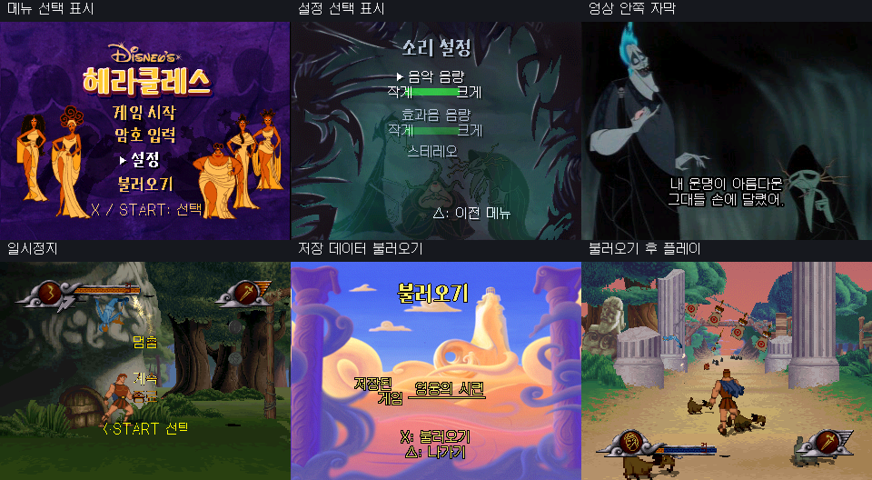

# 플레이스테이션 1 헤라클레스 한글패치

플레이스테이션 1용 《헤라클레스》의 비공식 팬 한글화 패치입니다.



## 내려받기

오른쪽의 **릴리스**에서 최신 `헤라클레스_한글패치_v0.4-beta.zip` 파일을 내려받아 압축을 풀어 주세요.

압축 파일에는 다음 자료가 들어 있습니다.

- `Hercules_PS1_USA_Rerelease_KO_v0.4-beta.xdelta` — 한글화 패치 파일
- `Hercules_KO.cue` — 에뮬레이터 실행용 CUE 파일

원본 게임 파일은 제공하지 않습니다. 패치를 사용하려면 정당하게 소유한 대응 버전의 원본 게임이 필요합니다.

## 적용 및 실행 방법

1. xdelta 형식의 패치를 적용할 수 있는 도구로 원본 게임에 패치 파일을 적용합니다.
2. 패치 적용 후 만들어진 결과 BIN 파일의 이름을 반드시 `Hercules_KO.bin`으로 변경합니다.
3. `Hercules_KO.bin`과 이 저장소에서 제공하는 `Hercules_KO.cue`를 같은 폴더에 둡니다.
4. 에뮬레이터에서는 BIN 파일이 아니라 `Hercules_KO.cue`를 선택해 실행합니다.

폴더 구성 예시:

```text
Hercules_KO.bin
Hercules_KO.cue
```

## 저작권 및 이용 안내

본 자료는 비공식 팬 한글화 패치입니다.

게임 본편, 캐릭터, 이미지, 음악, 상표 및 기타 원본 콘텐츠에 대한 모든 권리는 디즈니 및 각 관련 권리자에게 있습니다.

본 저장소는 원본 게임의 디스크 이미지, 실행 파일 또는 원본 게임 데이터를 배포하지 않으며, 한글화를 적용하기 위한 패치 파일만 제공합니다.

본 패치는 비영리·비상업적 목적으로 제작되었으며, 원본 게임을 합법적으로 소유한 사용자를 대상으로 합니다.

본 패치는 디즈니 또는 관련 권리자의 공식 승인, 제휴 또는 후원과 관계가 없습니다.

권리자의 정당한 요청이 있을 경우 관련 자료는 수정 또는 삭제될 수 있습니다.
